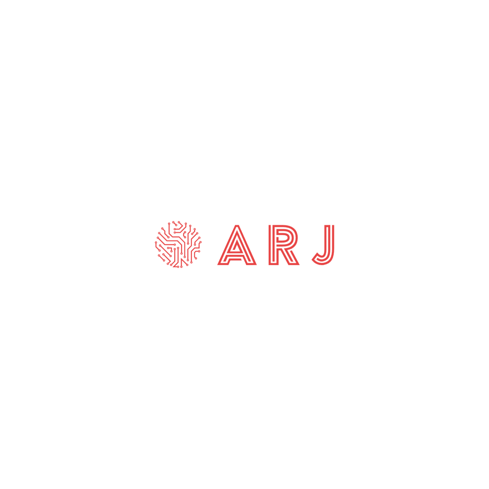

# 🚀 Atharva Joshi - Portfolio Website V3

The third iteration of my portfolio website built with Next.js 15, showcasing my
projects, skills, and professional experience as a Full Stack Developer.



## 🌟 Features

- **Modern Design**: Clean, minimalist interface with smooth animations
- **Responsive Layout**: Optimized for all device sizes and screen resolutions
- **Dark/Light Mode**: Toggle between themes with persistent user preference
- **Interactive Animations**: Smooth transitions and micro-interactions using
  Framer Motion
- **Contact Form**: Functional contact form with EmailJS integration
- **Performance Optimized**: Built with Next.js 15 for optimal loading speeds
- **SEO Friendly**: Proper meta tags and structured data for better search
  visibility
- **Accessibility**: WCAG compliant with proper semantic HTML and ARIA labels

## 🛠️ Tech Stack

### Frontend

- **Next.js 15**
- **React 18**
- **TypeScript**
- **Tailwind CSS**
- **Framer Motion**

### Tools & Libraries

- **EmailJS**
- **React Icons**
- **GSAP**
- **Vercel Analytics**
- **ESLint & Prettier**
- **Husky**

## 📁 Project Structure

```
ARJ-Portfolio-V3/
├── app/                    # Next.js App Router
│   ├── layout.tsx         # Root layout
│   └── page.tsx           # Home page
├── components/            # React components
│   ├── About.tsx         # About section
│   ├── Contact.tsx       # Contact form
│   ├── Experience.tsx    # Work experience
│   ├── Hero.tsx          # Hero section
│   ├── Projects.tsx      # Projects showcase
│   ├── Skills.tsx        # Skills display
│   └── ui/               # Reusable UI components
├── assets/               # Static assets
│   ├── projects/         # Project images
│   └── skills/           # Technology icons
├── lib/                  # Utility functions and data
├── styles/               # Global styles and fonts
├── context/              # React context providers
└── types/                # TypeScript type definitions
```

## 🔧 Available Scripts

- `bun dev` - Start development server with Turbo
- `bun build` - Build for production
- `bun start` - Start production server
- `bun lint` - Run ESLint
- `bun lint:fix` - Fix ESLint errors
- `bun format` - Format code with Prettier
- `bun check-types` - Run TypeScript type checking
- `bun clean` - Clean build files and reinstall dependencies

## 👨‍💻 About the Developer

I am **Atharva Joshi**

- 📧 Email: [atharvaj2160@gmail.com](mailto:atharvaj2160@gmail.com)
- 🌐 Portfolio: [https://www.atharvaj.site/]
- 💼 LinkedIn: [https://www.linkedin.com/in/arj2160/]
- 🐙 GitHub: [https://github.com/ARJ2160]

_Built with ❤️ using Next.js and TypeScript_
